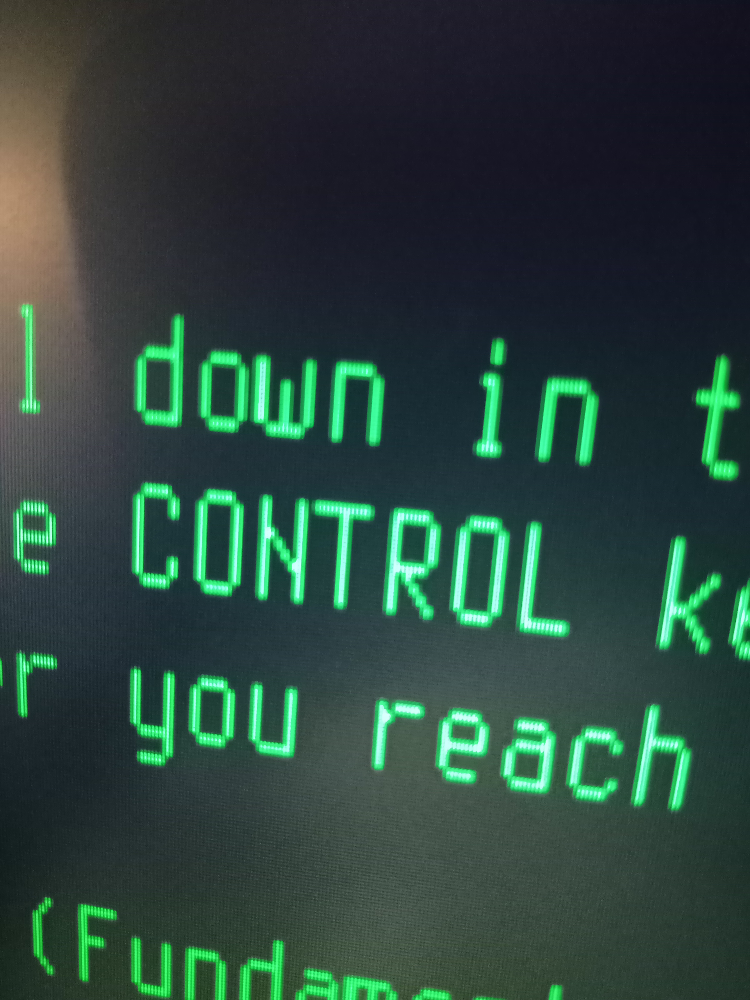
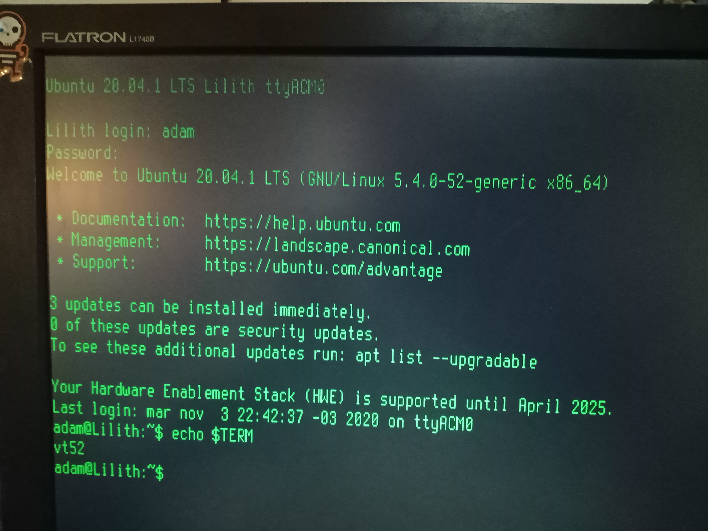

# fpga-vt52
vt52-fpga is a [serial
terminal](https://en.wikipedia.org/wiki/Computer_terminal) implemented
on a
[FPGA](https://en.wikipedia.org/wiki/Field-programmable_gate_array).
It's more or less compatible with the [DEC
VT52](https://en.wikipedia.org/wiki/VT52) (see below for missing
functionality).  It uses a regular PS/2 keyboard and VGA monitor
connected to a [TinyFPGA BX Board](https://tinyfpga.com/).  The serial
connection is over the integrated usb port on the board.

It is capable enough to be used as a serial terminal for a unix-like
system, running not only a regular shell but also full screen programs
like emacs or vim (screenshots in the img folder).

## Screenshots

## Motivation
I wanted to do a longer Verilog project to practice with the language
and test out some ideas but I also wanted to create something useful.
Once I arrived at the idea of a video terminal I settled on the VT52
as a simple enough candidate, with good documentation, a simple
command set & decent support on current systems.
I wrote it in pure Verilog without a processor so I could practice
writing different kind of modules, memories & FSMs instead of
forth/assembly/c.

## Design
100% Verilog with no processor to speak of.  Currently using about
2000 LUTS (about half of that for USB) and 18 RAM blocks (9KB).  There
are several submodules that interact to provide the functionality:

- **vt52.v**: main module, just instantiates all modules and connects
  everything together
- **char_buffer.v**: 2KB char buffer RAM to hold the 80x24 characters
- **char_rom.v**: 4KB char rom for the font (8x16, latin-1 character set)
- **video_generator.v**: vga video generation (green on black,
640x384, @70Hz) including syncs, cursor generation, combination of the
char buffer & char rom info. This is the only module that runs @24Mhz
(half usb clock speed)
- **keymap_rom.v**: 2KB rom to map ps/2 keycodes to different actions
- **keyboard.v**: ps/2 communication & keymap handling (including caps
  lock, shift, control and alt which is mapped to Esc+key)
- **command_handler.v**: interprets escape sequences and writes to the
  char buffer, cursor & scroll registers
- **cursor.v, cursor_blinker.v, simple_register.v**: cursor & scroll
  registers
- **tinyfpga_bx_usbserial/**: USB<->Serial bridge (9600 bps)
- **Makefile**: just do 'make' to compile or 'make prog' to program

## Connections
I'll try to add some schematics later, but basically I'm driving
everything with 3.3V directly from the FPGA. All keyboards and
monitors I tested don't seem to mind. So the PS/2 connector has 3.3V,
GND and two pull-up resistors from 3.3V to the CLK and DATA pins. The
VGA has two pins for hsync & vsync, one for ground & one pin with a
series resistor for the green channel.

## Limitations
The following features of the DEC VT52 are not implemented (most of
these probably never will)

- **Break key** (not as useful nowadays)
- **Repeat key** (we use normal PS/2 autorepeat)
- **Scroll key** (hold screen mode not implemented)
- **Copy key** (no copier)
- **Keypad** (the keyboard I'm using for testing doesn't have one)
- **Bell** (no speaker, and I find them pretty annoying anyways...)
- **Hold screen mode** (not as useful nowadays)
- **Alternate keypad mode** (no keypad implemented)
- **Graphics mode** (these are some 33 special symbols that the VT52 may
  send instead of regular chars, useful for crude graphs and some
  fractions)
- **Identify Terminal Type**

## Extensions & Future plans
Right now in addition to the VT52 stuff it supports the latin-1
character set and maps the alt key to an esc- prefix (useful for
emacs, mostly).

I'm considering implementing the Atari ST extensions (16 colors
foreground/background, inverse video, auto-wrap,
saving/restoring/hiding cursor, extra clear text commands)

## Dependencies
- Build tools: [Icestorm](http://www.clifford.at/icestorm/) (you will
  need NextPNR for this), and [tinyprog for the TinyFPGA
  BX](https://tinyfpga.com/bx/guide.html).

- The USB-serial interface is implemented with the
[tinyfpga_bx_usbserial](https://github.com/davidthings/tinyfpga_bx_usbserial)
module, which is included in the repo as a git submodule.

- The [terminus font](http://terminus-font.sourceforge.net/) is
included as a rom image (8x16 in regular and bold versions) in the mem
directory.

## Thanks
I want to thank to Luke Valenti for creating the Tinyfpga boards (and
even sending me a couple free of charge) and for the idea of
implementing the usb-serial bridge on the fpga fabric.  Also to Lawrie
Griffiths, David Williams and others for adapting that code for
general use.  I also want to thank Dimitar Toshkov Zhekov for the
amazing Terminus font, which looks a lot better than the old IBM fonts
I was using on the first prototypes.

## License
vt52-fpga is free software licensed under the GPLv3 or later. See
LICENSE for details. The included [terminus
font](http://terminus-font.sourceforge.net/), is an open font under
the SIL Open Font License, Version 1.1. See mem/ofl.txt for
details. USB-serial interface is implemented with the
[tinyfpga_bx_usbserial](https://github.com/davidthings/tinyfpga_bx_usbserial)
module (included in the repo as a git submodule).
tinyfpga_bx_usbserial is licensed under the Apache License 2.0, see
tinyfpga_bx_usbserial/LICENSE for details.
