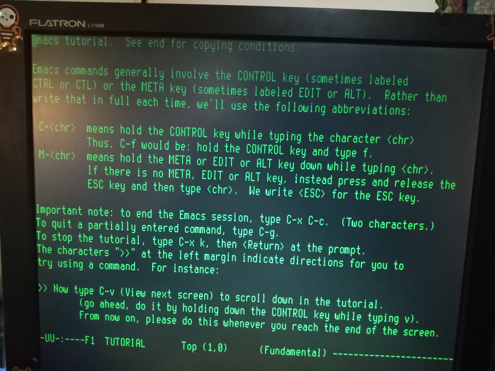
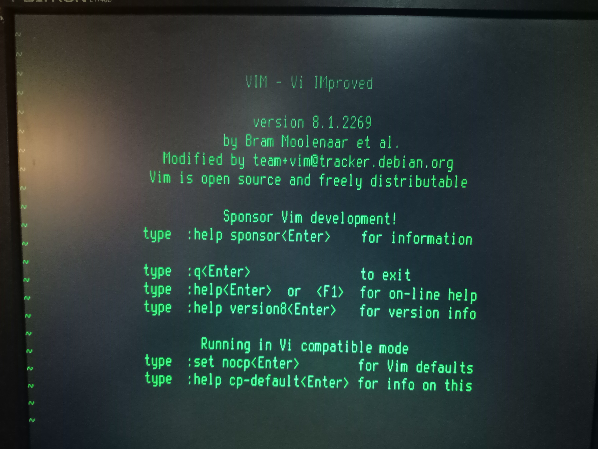
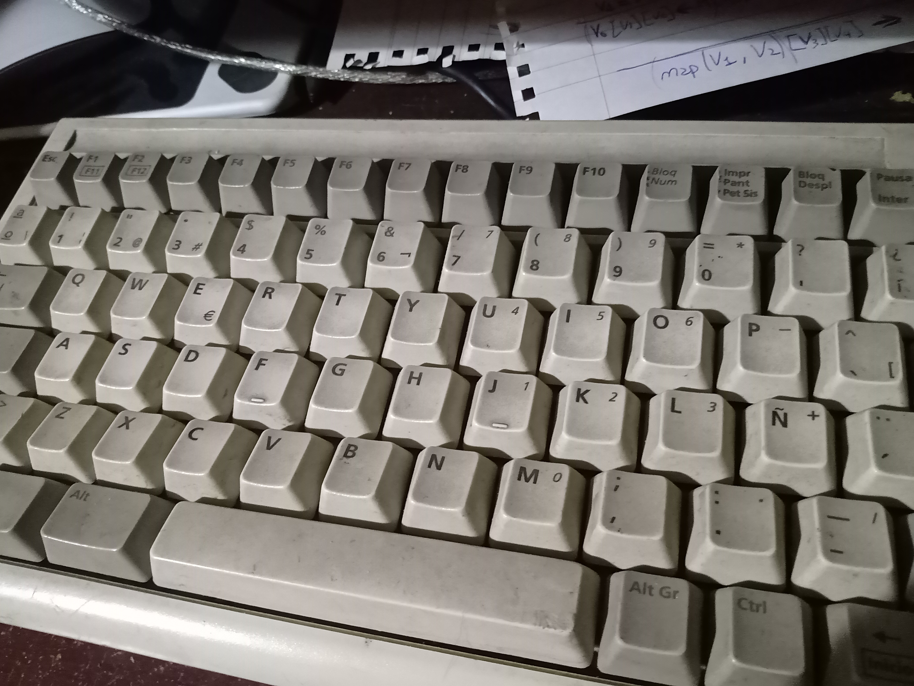
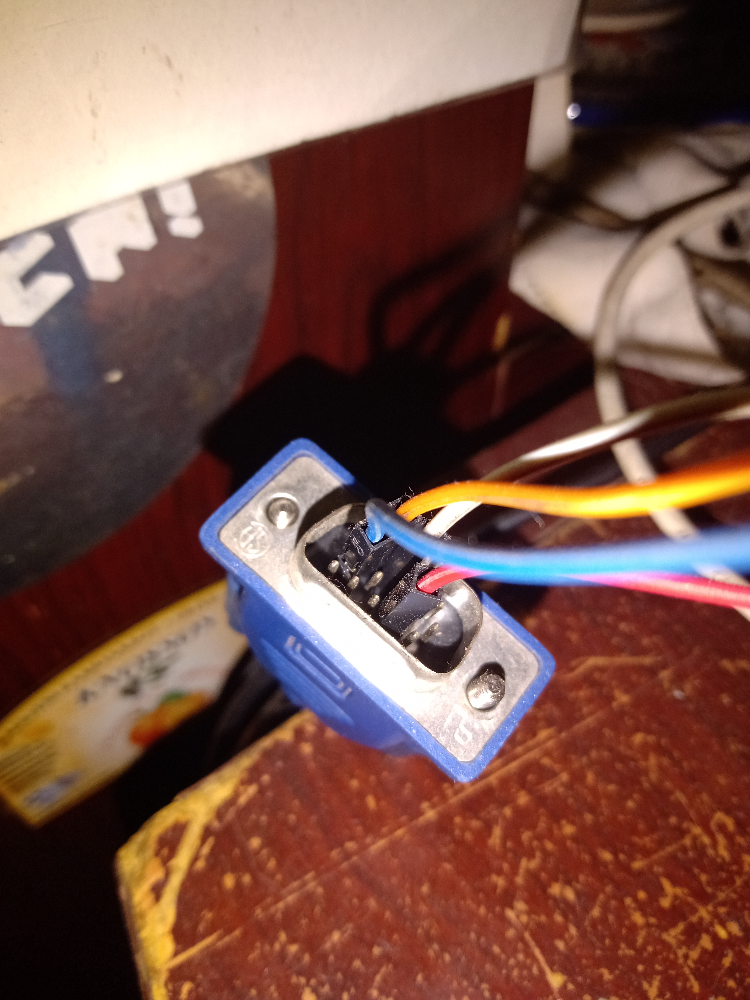
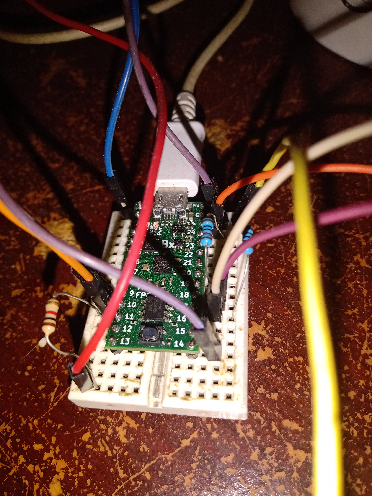

# fpga-vt52
vt52-fpga is a [serial
terminal](https://en.wikipedia.org/wiki/Computer_terminal) implemented
on a
[FPGA](https://en.wikipedia.org/wiki/Field-programmable_gate_array).
It's more or less compatible with the [DEC
VT52](https://en.wikipedia.org/wiki/VT52) (see below for missing
functionality).  It uses a regular PS/2 keyboard and VGA monitor
connected to a [TinyFPGA BX Board](https://tinyfpga.com/).  The serial
connection is over the integrated usb port on the board.

## Pics

## Dependencies
- Build tools: [Icestorm](http://www.clifford.at/icestorm/) (you will
  need NextPNR for this), and [tinyprog for the TinyFPGA
  BX](https://tinyfpga.com/bx/guide.html).

- The USB-serial interface is implemented with the
[tinyfpga_bx_usbserial](https://github.com/davidthings/tinyfpga_bx_usbserial)
module, which is included in the repo as a git submodule.

- The [terminus font](http://terminus-font.sourceforge.net/) is
included as a rom image (8x16 in regular and bold versions) in the mem
directory.

## Thanks
I want to thank to Luke Valenti for creating the Tinyfpga boards (and
even sending me a couple free of charge) and for the idea of
implementing the usb-serial bridge on the fpga fabric.  Also to Lawrie
Griffiths, David Williams and others for adapting that code for
general use.  I also want to thank Dimitar Toshkov Zhekov for the
amazing Terminus font, which looks a lot better than the old IBM fonts
I was using on the first prototypes.

## License
vt52-fpga is free software licensed under the GPLv3 or later. See
LICENSE for details. The included [terminus
font](http://terminus-font.sourceforge.net/), is an open font under
the SIL Open Font License, Version 1.1. See mem/ofl.txt for
details. USB-serial interface is implemented with the
[tinyfpga_bx_usbserial](https://github.com/davidthings/tinyfpga_bx_usbserial)
module (included in the repo as a git submodule).
tinyfpga_bx_usbserial is licensed under the Apache License 2.0, see
tinyfpga_bx_usbserial/LICENSE for details.
